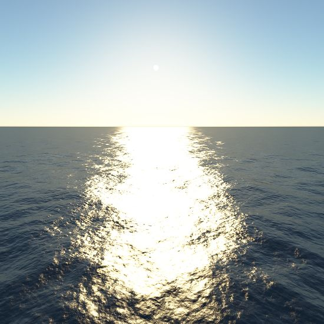
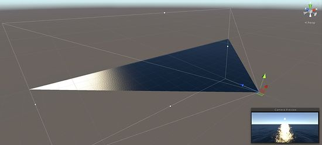

# Brunetons-Ocean

This is a ocean Ive ported to Unity and is based Eric Brunetons [ocean renderer](http://evasion.inrialpes.fr/~Eric.Bruneton/).

The focus of the project is the BRDF lighting model which looks very nice and is coupled with his previous work on atmospheric scattering.

You can find some settings on the ocean game object in the scene. You can change the wind speed, wave decay factor, wave amplitude, and the Fourier transform size. These settings are only used on start up however and will have no effect during run time. If you want to change them during run time you will need to regenerate the wave spectrum. Its only done on start up in this project. If your looking for what setting will make the waves bigger its the wind speed.

In Erics project he did use a projected grid for the ocean mesh but the implementation was not really robust enough to be practical. I have used a different implementation based on this [paper](http://fileadmin.cs.lth.se/graphics/theses/projects/projgrid/). I have left it as simple as possible so it will work but you may see the grid pull away from the screen if the waves are to large.

 
Below is a image of the projected grid. You can see the mesh is projected from the camera and its shape matches the camera frustum.

